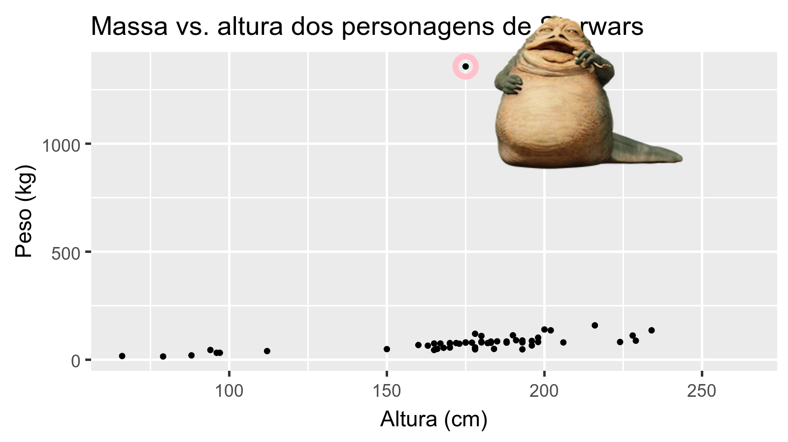

```{r child = "setup.Rmd"}
```

```{r packages, echo=FALSE, message=FALSE, warning=FALSE}
library(tidyverse)
library(magick)
library(Tmisc)
library(dsbox)
library(palmerpenguins)
```

```{r xaringan-tile-view, echo=FALSE}
xaringanExtra::use_tile_view()
```

```{r xaringan-editable, echo=FALSE}
xaringanExtra::use_editable(expires = 1)
```

```{r xaringan-panelset, echo=FALSE, message=FALSE, warning=FALSE}
xaringanExtra::use_panelset()
xaringanExtra::style_panelset_tabs(panel_tab_font_family = "sans-serif")
```

```{r xaringanExtra-clipboard, echo=FALSE}
htmltools::tagList(
  xaringanExtra::use_clipboard(
    button_text = "<i class=\"fa fa-clipboard\"></i>",
    success_text = "<i class=\"fa fa-check\" style=\"color: #90BE6D\"></i>",
    error_text = "<i class=\"fa fa-times-circle\" style=\"color: #F94144\"></i>"
  ),
  rmarkdown::html_dependency_font_awesome()
)
```

```{r xaringan-fit-screen, echo=FALSE}
xaringanExtra::use_fit_screen()
```

```{r xaringan-extra-styles, echo=FALSE}
xaringanExtra::use_extra_styles(
  hover_code_line = TRUE,         #<<
  mute_unhighlighted_code = TRUE  #<<
)
```

```{css include=FALSE}
.panelset {
   --panel-tab-foreground: currentColor;
   --panel-tab-background: unset;
   --panel-tab-active-foreground: currentColor;
   --panel-tab-active-background: unset;
   --panel-tab-active-border-color: currentColor;
   --panel-tab-hover-foreground: currentColor;
   --panel-tab-hover-background: unset;
   --panel-tab-hover-border-color: currentColor;
   --panel-tab-inactive-opacity: 0.5;
   --panel-tabs-border-bottom: #ddd;
   --panel-tab-font-family: Sen;
   --panel-tab-background-color-active: #fffbe0;
   --panel-tab-border-color-active: #023d4d;
}

.panelset .panel-tabs .panel-tab > a {
	color: #023d4d;
}

.panelset .panel-tabs {
  font-size: 0.5rem;
}
```

```{r, load_refs, include=FALSE, cache=FALSE}
library(RefManageR)
BibOptions(check.entries = FALSE,
           bib.style = "authoryear",
           cite.style = "alphabetic",
           style = "markdown",
           hyperlink = FALSE,
           dashed = FALSE)
myBib <- ReadBib("myBib.bib", check = FALSE)
library(knitcitations)
```

class: center, middle

## Retrospecto

---

## Modelo conceitual da análise de dados


---

## Tipos de dados

- Os tipos de dados mais comuns são `character`, `numeric`, `factor`e `logical`.

## Tipos de classes de objetos no R

- As classes de organização dos dados mais comuns são `vector`, `list`, `matrix` e `dataframe`.


---

## RMarkdown

```{r echo=FALSE, out.width="100%"}
knitr::include_graphics("img/render.png")
```
.footnote[
Alison Hill [Teaching in Production](https://rstudio-education.github.io/teaching-in-production/slides/index.html#1)
]

---

class: middle

# O que é um conjunto de dados?

---

## Terminologia

- Cada linha é uma **observação**
- Cada coluna é uma **variável**

```{r message=FALSE}
starwars
```

---

## Luke Skywalker


## O que está no conjunto de dados StarWars??

Dê uma olhada `glimpse` nos dados:

```{r}
glimpse(starwars)
```

---

.midi[
.question[
Quantas linhas e colunas tem este conjunto de dados?   
O que representa cada linha?   
O que representa cada coluna?   
]
]

```{r eval = FALSE}
?starwars
```

```{r echo=FALSE}
knitr::include_graphics("img/starwars-help.png")
```

---

.question[
Quantas linhas e colunas tem este conjunto de dados?
]

.pull-left[
```{r}
nrow(starwars) # number of rows
ncol(starwars) # number of columns
dim(starwars)  # dimensions (row column)
```
]

---

class: middle

# Análise exploratória de dados

---

## O que é AED?

- A análise exploratória de dados (AED) é uma abordagem para analisar conjuntos de dados visando resumir suas principais características
- Muitas vezes, é possível de maneira visual - é nisto que nos vamos concentrar primeiro
- Mas também podemos calcular estatísticas resumidas e realizar discussões/manipulação/transformação de dados nesta (ou antes) fase da análise -- é nisto que nos concentraremos a seguir

---

## Massa vs. altura

.midi[
.question[ 
Como você descreveria a relação entre massa e altura dos personagens de Starwars?   
Que outras variáveis nos ajudariam a entender as observações nos dados que não seguem a tendência geral?   
Quem é o personagem não tão alto mas realmente rechonchudo?   
]
]
--

```{r fig.width = 8, warning = FALSE, echo=FALSE, out.width = "50%"}
ggplot(data = starwars, mapping = aes(x = height, y = mass)) +
  geom_point() +
  labs(title = "Mass vs. height of Starwars characters",
       x = "Height (cm)", y = "Weight (kg)") +
  geom_point(data = starwars %>% filter(name == "Jabba Desilijic Tiure"), size = 5, pch = 1, color = "pink", stroke = 3)
```

---

## Jabba!

```{r echo = FALSE, warning = FALSE, cache = TRUE, out.width = "80%"}
jabba <- image_read("img/jabba.png")
fig <- image_graph(width = 1600, height = 900, res = 200)
ggplot(data = starwars, mapping = aes(x = height, y = mass)) +
  geom_point() +
  labs(title = "Massa vs. altura dos personagens de Starwars",
       x = "Altura (cm)", y = "Peso (kg)") +
  geom_point(data = starwars %>% filter(name == "Jabba Desilijic Tiure"), size = 5, pch = 1, color = "pink", stroke = 3)
dev.off()
out <- fig %>% image_composite(jabba, offset = "+1000+30")
image_write(out, "img/jabbaplot.png", format = "png")

```

---

class: middle

# Data visualization

---

## Visualização de dados

> *"The simple graph has brought more information to the data analyst's mind than any other device." --- John Tukey*
- A visualização de dados é a criação e estudo da representação visual dos dados
- Muitas ferramentas para visualização de dados -- R é uma delas
- Muitas abordagens/sistemas dentro de R para fazer visualizações de dados -- **ggplot2*** é uma delas, e é isso que vamos usar

---

## ggplot2 $\in$ tidyverse

.pull-left[
```{r echo=FALSE, out.width="80%"}
knitr::include_graphics("img/ggplot2-part-of-tidyverse.png")
```
] 
.pull-right[ 
- Oggplot2*** é o pacote de visualização de dados do tidyverse 
- ggplot2" em "ggplot2" significa Gramática Gráfica 
- Inspirado no livro **Gramática de Gráficos** de Leland Wilkinson
]

---

## Gramática dos gráficos

.pull-left-narrow[
Uma gramática de gráficos é uma ferramenta que nos permite descrever de forma concisa os componentes de um gráfico
]
.pull-right-wide[
```{r echo=FALSE, out.width="100%"}
knitr::include_graphics("img/grammar-of-graphics.png")
```
]

.footnote[ Source: [BloggoType](http://bloggotype.blogspot.com/2016/08/holiday-notes2-grammar-of-graphics.html)]

---

## Massa vs. altura

```{r mass-height, fig.width = 8, out.width = "40%"}
ggplot(data = starwars, mapping = aes(x = height, y = mass)) +
  geom_point() +
  labs(title = "Mass vs. height of Starwars characters",
       x = "Height (cm)", y = "Weight (kg)")
```

---

.question[ 
- Quais são as funções que fazem a plotagem?
- Qual é o conjunto de dados que está sendo plotado?
- Quais variáveis mapeiam quais características (estética) da plotagem?
- O que significa o aviso?<sup>+</sup>
]

```{r ref.label="mass-height", fig.show = "hide"}
```

.footnote[
<sup>+</sup>Suprimindo aviso para os slides subseqüentes para economizar espaço
]


---

## Hello ggplot2!

- ggplot() é a função principal no ggplot2
- As parcelas são construídas em camadas
- A estrutura do código para as parcelas pode ser resumida como

```{r eval = FALSE}
ggplot(data = [dataset], 
       mapping = aes(x = [x-variable], y = [y-variable])) +
   geom_xxx() +
   other options
```

- O pacote ggplot2 vem com o pacote tidyverse

```{r}
library(tidyverse)
```

- Para ajuda com ggplot2, veja [ggplot2.tidyverse.org](http://ggplot2.tidyverse.org/)

---

class: middle

# Por que visualizamos?

---

## O quarteto de Anscombe

```{r quartet-for-show, eval = FALSE, echo = FALSE}
library(Tmisc)
quartet
```

.small[
.pull-left[
```{r quartet-view1, echo = FALSE}
quartet[1:22,]
```
] 
]

.small[
.pull-right[
```{r quartet-view2, echo = FALSE}
quartet[23:44,]
```
]
]

---

## Resumindo o quarteto da Anscombe

```{r quartet-summary}
quartet %>%
  group_by(set) %>%
  summarise(
    mean_x = mean(x), 
    mean_y = mean(y),
    sd_x = sd(x),
    sd_y = sd(y),
    r = cor(x, y)
  )
```

---

## Visualizando o quarteto de Anscombe

```{r quartet-plot, echo = FALSE, out.width = "80%", fig.asp = 0.5}
ggplot(quartet, aes(x = x, y = y)) +
  geom_point() +
  facet_wrap(~ set, ncol = 4)
```

---

## Idade no primeiro beijo

.question[ 
Você vê algo fora do comum?
]

```{r echo = FALSE, warning = FALSE}
ggplot(student_survey, aes(x = first_kiss)) +
  geom_histogram(binwidth = 1) +
  labs(
    title = "Quantos anos você tinha quando deu seu primeiro beijo?", 
    x = "Idade (anos)", y = NULL
    )
```

---

## Visitas ao Facebook

.question[ 
Como as pessoas estão relatando valores mais baixos versus valores mais altos de visitas da FB?
]

```{r echo = FALSE, warning = FALSE, out.width="50%"}
ggplot(student_survey, aes(x = fb_visits_per_day)) +
  geom_histogram(binwidth = 1) +
  labs(
    title = "Quantas vezes você acessa o Facebook por dia?", 
    x = "Número de vezes", y = NULL
    )
```

---
class: middle

# ggplot2 `r emo::ji("heart")` `r emo::ji("penguin")`

---

## ggplot2 $\in$ tidyverse

.pull-left[
```{r echo=FALSE, out.width="80%"}
knitr::include_graphics("img/ggplot2-part-of-tidyverse.png")
```
] 
.pull-right[ 
- **ggplot2** is tidyverse's data visualization package 
- Structure of the code for plots can be summarized as

```{r eval = FALSE}
ggplot(data = [dataset], 
       mapping = aes(x = [x-variable], 
                     y = [y-variable])) +
   geom_xxx() +
   other options
```
]

---

## Data: Palmer Penguins

Medidas para espécies de pinguins, ilha no Arquipélago de Palmer, tamanho (comprimento da barbatana, massa corporal, dimensões do bico) e sexo.

.pull-left-narrow[
```{r echo=FALSE, out.width="80%"}
knitr::include_graphics("img/penguins.png")
```
]
.pull-right-wide[
```{r}
library(palmerpenguins)
glimpse(penguins)
```
]

---

.panelset[
.panel[.panel-name[Plot]
```{r ref.label = "penguins", echo = FALSE, warning = FALSE, out.width = "70%", fig.width = 8}
```
]
.panel[.panel-name[Código]

```{r penguins, fig.show = "hide"}
ggplot(data = penguins, 
       mapping = aes(x = bill_depth_mm, y = bill_length_mm,
                     colour = species)) +
  geom_point() +
  labs(title = "Largura e comprimento do bico",
       subtitle = "Dimensões de Adelie, Chinstrap, e Gentoo Penguins",
       x = "Largura do bico (mm)", y = "Comprimento do bico (mm)",
       colour = "Espécies")
```
]
]

---

class: middle

# Codificação em voz alta

---

.midi[
> **Comece com o data frame `penguins`**
]

.pull-left[
```{r penguins-0, fig.show = "hide", warning = FALSE}
ggplot(data = penguins) #<<
```
]
.pull-right[
```{r ref.label = "penguins-0", echo = FALSE, warning = FALSE, out.width = "100%", fig.width = 8}
```
]

---

.midi[
> Comece com o dataframe `penguins`,
> **atribua a largura do bico (bill depth) ao eixo x**
]

.pull-left[
```{r penguins-1, fig.show = "hide", warning = FALSE}
ggplot(data = penguins,
       mapping = aes(x = bill_depth_mm)) #<<
```
]
.pull-right[
```{r ref.label = "penguins-1", echo = FALSE, warning = FALSE, out.width = "100%", fig.width = 8}
```
]

---

.midi[
> Comece com o dataframe `penguins`,
> atribua a largura do bico (bill depth) ao eixo x
> **e atribua o comprimento do bico (bill length) ao eixo y**
]

.pull-left[
```{r penguins-2, fig.show = "hide", warning = FALSE}
ggplot(data = penguins,
       mapping = aes(x = bill_depth_mm,
                     y = bill_length_mm)) #<<
```
]
.pull-right[
```{r ref.label = "penguins-2", echo = FALSE, warning = FALSE, out.width = "100%", fig.width = 8}
```
]

---

.midi[
> Comece com o dataframe `penguins`,
> atribua a largura do bico (bill depth) ao eixo x
> e atribua o comprimento do bico (bill length) ao eixo y.
> **Represente cada observação com um ponto**
]

.pull-left[
```{r penguins-3, fig.show = "hide", warning = FALSE}
ggplot(data = penguins,
       mapping = aes(x = bill_depth_mm,
                     y = bill_length_mm)) + 
  geom_point() #<<
```
]
.pull-right[
```{r ref.label = "penguins-3", echo = FALSE, warning = FALSE, out.width = "100%", fig.width = 8}
```
]

---

.midi[
> Comece com o dataframe `penguins`,
> atribua a largura do bico (bill depth) ao eixo x
> e atribua o comprimento do bico (bill length) ao eixo y.
> Represente cada observação com um ponto
> **e mapeie as espécies para a cor de cada ponto.**
]

.pull-left[
```{r penguins-4, fig.show = "hide", warning = FALSE}
ggplot(data = penguins,
       mapping = aes(x = bill_depth_mm,
                     y = bill_length_mm,
                     colour = species)) + #<<
  geom_point()
```
]
.pull-right[
```{r ref.label = "penguins-4", echo = FALSE, warning = FALSE, out.width = "100%", fig.width = 8}
```
]

---

.midi[
> Comece com o dataframe `penguins`,
> atribua a largura do bico (bill depth) ao eixo x
> e atribua o comprimento do bico (bill length) ao eixo y.
> Represente cada observação com um ponto
> e mapeie as espécies para a cor de cada ponto
> **Título do gráfico "Largura e comprimento do bico"**
]

.pull-left[
```{r penguins-5, fig.show = "hide", warning = FALSE}
ggplot(data = penguins,
       mapping = aes(x = bill_depth_mm,
                     y = bill_length_mm,
                     colour = species)) +
  geom_point() +
  labs(title = "Largura e comprimento do bico") #<<
```
]
.pull-right[
```{r ref.label = "penguins-5", echo = FALSE, warning = FALSE, out.width = "100%", fig.width = 8}
```
]

---

.midi[
> Comece com o dataframe `penguins`,
> atribua a largura do bico (bill depth) ao eixo x
> e atribua o comprimento do bico (bill length) ao eixo y.
> Represente cada observação com um ponto
> e mapeie as espécies para a cor de cada ponto
> Título do gráfico "Largura e comprimento do bico"
> **e adicione o subtítulo "Dimensões para penguins Adelie, Chinstrap, e Gentoo"**
]

.pull-left[
```{r penguins-6, fig.show = "hide", warning = FALSE}
ggplot(data = penguins,
       mapping = aes(x = bill_depth_mm,
                     y = bill_length_mm,
                     colour = species)) +
  geom_point() +
  labs(title = "Largura e comprimento do bico",
       subtitle = "Dimensões para penguins Adelie, Chinstrap, e Gentoo") #<<
```
]
.pull-right[
```{r ref.label = "penguins-6", echo = FALSE, warning = FALSE, out.width = "100%", fig.width = 8}
```
]

---

.midi[
> Comece com o dataframe `penguins`,
> atribua a largura do bico (bill depth) ao eixo x
> e atribua o comprimento do bico (bill length) ao eixo y.
> Represente cada observação com um ponto
> e mapeie as espécies para a cor de cada ponto
> Título do gráfico "Largura e comprimento do bico",
> e adicione o subtítulo "Dimensões para penguins Adelie, Chinstrap, e Gentoo", 
> **rotule os eixos x e y como "Largura do bico (mm)" and "Comprimento do bico (mm)", respectivamente**
]

.pull-left[
```{r penguins-7, fig.show = "hide", warning = FALSE}
ggplot(data = penguins,
       mapping = aes(x = bill_depth_mm,
                     y = bill_length_mm,
                     colour = species)) +
  geom_point() +
  labs(title = "Largura e comprimento do bico",
       subtitle = "Dimensões para penguins Adelie, Chinstrap, e Gentoo",
       x = "Largura do bico (mm)", y = "Comprimento do bico (mm)") #<<
```
]
.pull-right[
```{r ref.label = "penguins-7", echo = FALSE, warning = FALSE, out.width = "100%", fig.width = 8}
```
]

---

.midi[
> Comece com o dataframe `penguins`,
> atribua a largura do bico (bill depth) ao eixo x
> e atribua o comprimento do bico (bill length) ao eixo y.
> Represente cada observação com um ponto
> e mapeie as espécies para a cor de cada ponto
> Título do gráfico "Largura e comprimento do bico",
> e adicione o subtítulo "Dimensões para penguins Adelie, Chinstrap, e Gentoo", 
> rotule os eixos x e y como "Largura do bico (mm)" and "Comprimento do bico (mm)", respectivamente,
> **rotule a legenda "Espécies"**
]

.pull-left[
```{r penguins-8, fig.show = "hide", warning = FALSE}
ggplot(data = penguins,
       mapping = aes(x = bill_depth_mm,
                     y = bill_length_mm,
                     colour = species)) +
  geom_point() +
  labs(title = "Largura e comprimento do bico",
       subtitle = "Dimensões para penguins Adelie, Chinstrap, e Gentoo",
       x = "Largura do bico (mm)", y = "Comprimento do bico (mm)",
       colour = "Espécies") #<<
```
]
.pull-right[
```{r ref.label = "penguins-8", echo = FALSE, warning = FALSE, out.width = "100%", fig.width = 8}
```
]

---

.midi[
> Comece com o dataframe `penguins`,
> atribua a largura do bico (bill depth) ao eixo x
> e atribua o comprimento do bico (bill length) ao eixo y.
> Represente cada observação com um ponto
> e mapeie as espécies para a cor de cada ponto
> Título do gráfico "Largura e comprimento do bico",
> e adicione o subtítulo "Dimensões para penguins Adelie, Chinstrap, e Gentoo", 
> rotule os eixos x e y como "Largura do bico (mm)" and "Comprimento do bico (mm)", respectivamente,
> rotule a legenda "Espécies" 
> **e adicione uma legenda para os dados.**
]

.pull-left[
```{r penguins-9, fig.show = "hide", warning = FALSE}
ggplot(data = penguins,
       mapping = aes(x = bill_depth_mm,
                     y = bill_length_mm,
                     colour = species)) +
  geom_point() +
  labs(title = "Largura e comprimento do bico",
       subtitle = "Dimensões para penguins Adelie, Chinstrap, e Gentoo",
       x = "Largura do bico (mm)", y = "Comprimento do bico (mm)",
       colour = "Espécies",
       caption = "Dados: Palmer Station LTER / palmerpenguins package") #<<
```
]
.pull-right[
```{r ref.label = "penguins-9", echo = FALSE, warning = FALSE, out.width = "100%", fig.width = 8}
```
]

---

.midi[
> Comece com o dataframe `penguins`,
> atribua a largura do bico (bill depth) ao eixo x
> e atribua o comprimento do bico (bill length) ao eixo y.
> Represente cada observação com um ponto
> e mapeie as espécies para a cor de cada ponto
> Título do gráfico "Largura e comprimento do bico",
> e adicione o subtítulo "Dimensões para penguins Adelie, Chinstrap, e Gentoo", 
> rotule os eixos x e y como "Largura do bico (mm)" and "Comprimento do bico (mm)", respectivamente,
> rotule a legenda "Espécies" 
> e adicione uma legenda para os dados.
> **Finalmente, utilize uma escala de cores discreta para leitores com algum tipo de daltonismo.**
]

.pull-left[
```{r penguins-10, fig.show = "hide", warning = FALSE}
ggplot(data = penguins,
       mapping = aes(x = bill_depth_mm,
                     y = bill_length_mm,
                     colour = species)) +
  geom_point() +
  labs(title = "Largura e comprimento do bico",
       subtitle = "Dimensões para penguins Adelie, Chinstrap, e Gentoo",
       x = "Largura do bico (mm)", y = "Comprimento do bico (mm)",
       colour = "Espécies",
       caption = "Dados: Palmer Station LTER / palmerpenguins package") +
  scale_colour_viridis_d() #<<
```
]
.pull-right[
```{r ref.label = "penguins-10", echo = FALSE, warning = FALSE, out.width = "100%", fig.width = 8}
```
]

---

.panelset[
.panel[.panel-name[Plot]
```{r ref.label="penguins-10-nohighlight", echo = FALSE, warning = FALSE, out.width = "70%", fig.width = 8}
```
]
.panel[.panel-name[Code]

```{r penguins-10-nohighlight, fig.show = "hide"}
ggplot(data = penguins,
       mapping = aes(x = bill_depth_mm,
                     y = bill_length_mm,
                     colour = species)) +
  geom_point() +
  labs(title = "Largura e comprimento do bico",
       subtitle = "Dimensões para penguins Adelie, Chinstrap, e Gentoo",
       x = "Largura do bico (mm)", y = "Comprimento do bico (mm)",
       colour = "Espécies",
       caption = "Dados: Palmer Station LTER / palmerpenguins package") +
  scale_colour_viridis_d()
```
]

.panel[.panel-name[Narrative]
.midi[

Comece com o dataframe `penguins`, atribua a largura do bico (bill depth) ao eixo x e atribua o comprimento do bico (bill length) ao eixo y.   
Represente cada observação com um ponto e mapeie as espécies para a cor de cada ponto.    

Título do gráfico "Largura e comprimento do bico", e adicione o subtítulo "Dimensões para penguins Adelie, Chinstrap, e Gentoo", rotule os eixos x e y como "Largura do bico (mm)" and "Comprimento do bico (mm)", respectivamente. 

Rotule a legenda "Espécies" e adicione uma legenda para os dados.

Finalmente, utilize uma escala de cores discreta para leitores com algum tipo de daltonismo.
]
]

]

---

## Nomes dos argumentos

.tip[
Você pode omitir os nomes dos dois primeiros argumentos ao construir gráfico com `ggplot()`.
]

.pull-left[
```{r named-args, eval = FALSE}
ggplot(data = penguins,
       mapping = aes(x = bill_depth_mm,
                     y = bill_length_mm,
                     colour = species)) +
  geom_point() +
  scale_colour_viridis_d()
```
]
.pull-right[
```{r not-named-args, eval = FALSE}
ggplot(penguins,
       aes(x = bill_depth_mm,
           y = bill_length_mm,
           colour = species)) +
  geom_point() +
  scale_colour_viridis_d()
```
]

---

class: middle

# Aesthetics

---

## Opções de Aesthetics

Parâmetros de gráficos que podem ser **especificados para uma variável** nos dado são

- `colour`
- `shape`
- `size`
- `alpha` (transparência)

---

## Cor

.pull-left[
```{r colour, fig.show = "hide", warning = FALSE}
ggplot(penguins,
       aes(x = bill_depth_mm, 
           y = bill_length_mm,
           colour = species)) + #<<
  geom_point() +
  scale_colour_viridis_d()
```
]
.pull-right[
```{r ref.label = "colour", echo = FALSE, warning = FALSE, out.width = "100%"}
```
]

---

## Forma

Mapeado para uma variável diferente da **cor**.

.pull-left[
```{r shape-island, fig.show = "hide", warning = FALSE}
ggplot(penguins,
       aes(x = bill_depth_mm, 
           y = bill_length_mm,
           colour = species,
           shape = island)) + #<<
  geom_point() +
  scale_colour_viridis_d()
```
]
.pull-right[
```{r ref.label = "shape-island", echo = FALSE, warning = FALSE, out.width = "100%"}
```
]

---

## Forma

Mapeado para a mesma variável como **cor**.

.pull-left[
```{r shape-species, fig.show = "hide", warning = FALSE}
ggplot(penguins,
       aes(x = bill_depth_mm, 
           y = bill_length_mm,
           colour = species,
           shape = species)) + #<<
  geom_point() +
  scale_colour_viridis_d()
```
]
.pull-right[
```{r ref.label = "shape-species", echo = FALSE, warning = FALSE, out.width = "100%"}
```
]

---

## Tamanho

.pull-left[
```{r size, fig.show = "hide", warning = FALSE}
ggplot(penguins,
       aes(x = bill_depth_mm, 
           y = bill_length_mm,
           colour = species,
           shape = species,
           size = body_mass_g)) + #<<
  geom_point() +
  scale_colour_viridis_d()
```
]
.pull-right[
```{r ref.label = "size", echo = FALSE, warning = FALSE, out.width = "100%"}
```
]

---

## Alpha

.pull-left[
```{r alpha, fig.show = "hide", warning = FALSE}
ggplot(penguins,
       aes(x = bill_depth_mm, 
           y = bill_length_mm,
           colour = species,
           shape = species,
           size = body_mass_g,
           alpha = flipper_length_mm)) + #<<
  geom_point() +
  scale_colour_viridis_d()
```
]
.pull-right[
```{r ref.label = "alpha", echo = FALSE, warning = FALSE, out.width = "100%"}
```
]

---

.pull-left[
**Mapping**

```{r warning = FALSE, out.width = "100%"}
ggplot(penguins,
       aes(x = bill_depth_mm,
           y = bill_length_mm,
           size = body_mass_g, #<<
           alpha = flipper_length_mm)) + #<<
  geom_point()
```
]
.pull-right[
**Setting**

```{r warning = FALSE, out.width = "100%"}
ggplot(penguins,
       aes(x = bill_depth_mm,
           y = bill_length_mm)) + 
  geom_point(size = 2, alpha = 0.5) #<<
```
]

---

## Mapping vs. setting

- **Mapping:** Determinar o tamanho, alfa, etc. dos pontos com base nos valores de uma variável nos dados
  - vai para `aes()`

- **Setting:** Determinar o tamanho, alfa, etc. dos pontos **não** com base nos valores de uma variável nos dados
  - entra em `geom_*()` (isto foi `geom_point()` no exemplo anterior, mas aprenderemos sobre outros geoms em breve!)
  
---

class: middle

# Faceting

---

## Faceting

- gráficos menores que exibem diferentes subconjuntos dos dados
- Útil para explorar relações condicionais e grandes dados

---

.panelset[
.panel[.panel-name[Plot]
```{r ref.label = "facet", echo = FALSE, warning = FALSE, out.width = "70%"}
```
]
.panel[.panel-name[Código]

```{r facet, fig.show = "hide"}
ggplot(penguins, aes(x = bill_depth_mm, y = bill_length_mm)) + 
  geom_point() +
  facet_grid(species ~ island) #<<
```
]
]

---

## Várias maneiras de fazer "facets"

.question[
Nos próximos slides, descreva o que cada gráfico apresenta. Pense em como o código se relaciona com a saída.

**Nota:** Os gráficos nos próximos slides não têm títulos, rótulos de eixos, etc., porque queremos que você descubra o que está acontecendo nos gráficos. Mas você deve sempre rotular!
]

---

```{r warning = FALSE}
ggplot(penguins, aes(x = bill_depth_mm, y = bill_length_mm)) + 
  geom_point() +
  facet_grid(species ~ sex) #<<
```

---

```{r warning = FALSE}
ggplot(penguins, aes(x = bill_depth_mm, y = bill_length_mm)) + 
  geom_point() +
  facet_grid(sex ~ species) #<<
```

---

```{r warning = FALSE, fig.asp = 0.5}
ggplot(penguins, aes(x = bill_depth_mm, y = bill_length_mm)) + 
  geom_point() +
  facet_wrap(~ species) #<<
```

---

```{r warning = FALSE, fig.asp = 0.5}
ggplot(penguins, aes(x = bill_depth_mm, y = bill_length_mm)) + 
  geom_point() +
  facet_grid(. ~ species) #<<
```

---

```{r warning = FALSE}
ggplot(penguins, aes(x = bill_depth_mm, y = bill_length_mm)) + 
  geom_point() +
  facet_wrap(~ species, ncol = 2) #<<
```

---

## Resumo Faceting 

- `facet_grid()`:
    - Grid em duas dimensões
    - `rows ~ cols`
    - use `.` para não separar
- `facet_wrap()`: Representação em uma dimensão de acordo com o número de linhas e colunas especificadas ou com a área de plotagem disponível

---

## Facet e cores

.pull-left-narrow[
```{r facet-color-legend, fig.show = "hide", warning = FALSE}
ggplot(
  penguins, 
  aes(x = bill_depth_mm, 
      y = bill_length_mm, 
      color = species)) + #<<
  geom_point() +
  facet_grid(species ~ sex) +
  scale_color_viridis_d() #<<
```
]
.pull-right-wide[
```{r ref.label = "facet-color-legend", echo = FALSE, warning = FALSE, out.width = "100%"}
```
]

---

## Facet e cor, sem legenda

.pull-left-narrow[
```{r facet-color-no-legend, fig.show = "hide", warning = FALSE}
ggplot(
  penguins, 
  aes(x = bill_depth_mm, 
      y = bill_length_mm, 
      color = species)) +
  geom_point() +
  facet_grid(species ~ sex) +
  scale_color_viridis_d() +
  guides(color = FALSE) #<<
```
]
.pull-right-wide[
```{r ref.label = "facet-color-no-legend", echo = FALSE, warning = FALSE, out.width = "100%"}
```
]


